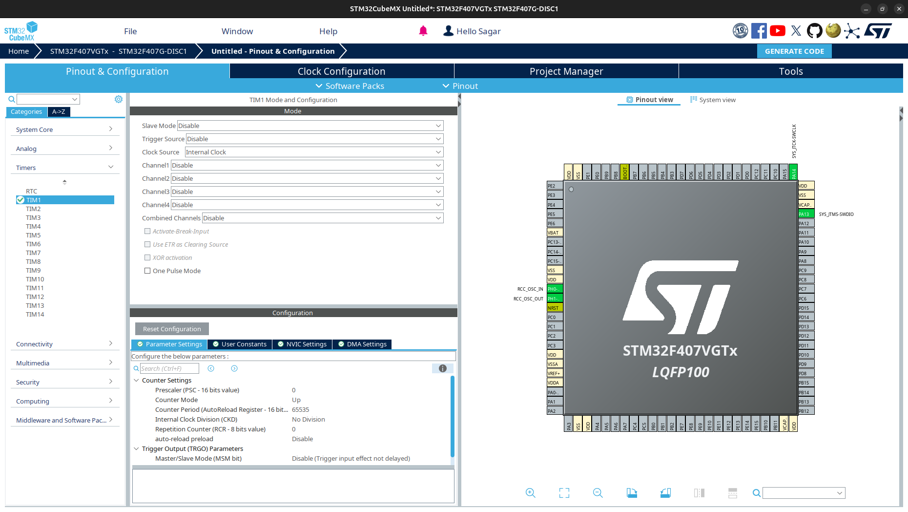

C++ Setup in STM32
==================

.. contents:: Contents
   :depth: 2
   :local:

1. CubeMX Configuration
-----------------------

There is nothing special to do in CubeMX for C++ setup. You can follow the same steps as in `C setup <../basic_setup/generate_basic_code.html>`__. First we see ``makefile`` then ``cmake``. Also make a pin ``GPIO_Output`` for LED. For example, in ``bluepill (STM32F103C8)``, pin ``PC13`` is connected to LED.

.. note::
   You can generate code using toolchain as ``Makefile``, then later migrate to ``CMake``, and vice versa.

2. Update Makefile to Compile C++ Code
--------------------------------------

.. note::
   Add the block to ``Makefile`` which have **green border at left**.

2.1. Add ``CXX_SOURCES`` after ``C_SOURCES``:
^^^^^^^^^^^^^^^^^^^^^^^^^^^^^^^^^^^^^^^^^^^^^

.. code-block::
    
   # C sources
   C_SOURCES =  \
   Core/Src/main.c \
   Core/Src/gpio.c \
   Core/Src/stm32f4xx_it.c \
   Core/Src/stm32f4xx_hal_msp.c \
   Drivers/STM32F4xx_HAL_Driver/Src/stm32f4xx_hal_rcc.c \
   Drivers/STM32F4xx_HAL_Driver/Src/stm32f4xx_hal_rcc_ex.c \
   Drivers/STM32F4xx_HAL_Driver/Src/stm32f4xx_hal_flash.c \
   Drivers/STM32F4xx_HAL_Driver/Src/stm32f4xx_hal_flash_ex.c \
   Drivers/STM32F4xx_HAL_Driver/Src/stm32f4xx_hal_flash_ramfunc.c \
   Drivers/STM32F4xx_HAL_Driver/Src/stm32f4xx_hal_gpio.c \
   Drivers/STM32F4xx_HAL_Driver/Src/stm32f4xx_hal_dma_ex.c \
   Drivers/STM32F4xx_HAL_Driver/Src/stm32f4xx_hal_dma.c \
   Drivers/STM32F4xx_HAL_Driver/Src/stm32f4xx_hal_pwr.c \
   Drivers/STM32F4xx_HAL_Driver/Src/stm32f4xx_hal_pwr_ex.c \
   Drivers/STM32F4xx_HAL_Driver/Src/stm32f4xx_hal_cortex.c \
   Drivers/STM32F4xx_HAL_Driver/Src/stm32f4xx_hal.c \
   Drivers/STM32F4xx_HAL_Driver/Src/stm32f4xx_hal_exti.c \
   Drivers/STM32F4xx_HAL_Driver/Src/stm32f4xx_hal_tim.c \
   Drivers/STM32F4xx_HAL_Driver/Src/stm32f4xx_hal_tim_ex.c \
   Core/Src/system_stm32f4xx.c \
   Core/Src/sysmem.c \
   Core/Src/syscalls.c

.. code-block:: makefile
   :class: left-green-border

   # CXX sources
   CXX_SOURCES = 

.. code-block::

   # ASM sources
   ASM_SOURCES =  \
   startup_stm32f407xx.s

2.2. Add Compiler for C++:
^^^^^^^^^^^^^^^^^^^^^^^^^^

.. code-block:: makefile

   ifdef GCC_PATH
   CC = $(GCC_PATH)/$(PREFIX)gcc
   AS = $(GCC_PATH)/$(PREFIX)gcc -x assembler-with-cpp
   CP = $(GCC_PATH)/$(PREFIX)objcopy
   SZ = $(GCC_PATH)/$(PREFIX)size

.. code-block:: makefile
   :class: left-green-border

   CXX = $(GCC_PATH)/$(PREFIX)g++

.. code-block:: makefile

   else
   CC = $(PREFIX)gcc
   AS = $(PREFIX)gcc -x assembler-with-cpp
   CP = $(PREFIX)objcopy
   SZ = $(PREFIX)size

.. code-block:: makefile
   :class: left-green-border

   CXX = $(PREFIX)g++

.. code-block:: makefile

   else
   CC = $(PREFIX)gcc
   AS = $(PREFIX)gcc -x assembler-with-cpp
   CP = $(PREFIX)objcopy
   SZ = $(PREFIX)size

2.3. Add ``CXX_INCLUDE`` after ``C_INCLUDES``:
^^^^^^^^^^^^^^^^^^^^^^^^^^^^^^^^^^^^^^^^^^^^^^

.. code-block:: text

   # C includes
   C_INCLUDES =  \
   -ICore/Inc \
   -IDrivers/STM32F4xx_HAL_Driver/Inc \
   -IDrivers/STM32F4xx_HAL_Driver/Inc/Legacy \
   -IDrivers/CMSIS/Device/ST/STM32F4xx/Include \
   -IDrivers/CMSIS/Include

.. code-block:: makefile
   :class: left-green-border

   # CXX Includes
   CXX_INCLUDES = \
   $(C_INCLUDES)

2.4. Add CXXFLAGS:
^^^^^^^^^^^^^^^^^^

.. code-block:: makefile

   # compile gcc flags
   ASFLAGS = $(MCU) $(AS_DEFS) $(AS_INCLUDES) $(OPT) -Wall -fdata-sections -ffunction-sections
   
   CFLAGS += $(MCU) $(C_DEFS) $(C_INCLUDES) $(OPT) -Wall -fdata-sections -ffunction-sections
   
   ifeq ($(DEBUG), 1)
   CFLAGS += -g -gdwarf-2
   endif
   
   
   # Generate dependency information
   CFLAGS += -MMD -MP -MF"$(@:%.o=%.d)"

.. code-block:: makefile
   :class: left-green-border
    
   CXXFLAGS = $(CFLAGS) $(CXX_INCLUDES)

2.5. Add list of objects for CXX:
^^^^^^^^^^^^^^^^^^^^^^^^^^^^^^^^^

.. literalinclude:: makefiles/cpp_setup/c_asm_objects
   :language: makefile

.. literalinclude:: makefiles/cpp_setup/cpp_objects
   :language: makefile
   :class: left-green-border

2.6. Add to build cpp files:
^^^^^^^^^^^^^^^^^^^^^^^^^^^^

.. literalinclude:: makefiles/cpp_setup/build_c_asm
   :language: makefile

.. literalinclude:: makefiles/cpp_setup/build_cpp
   :language: makefile
   :class: left-green-border

.. literalinclude:: makefiles/cpp_setup/build_target
   :language: makefile

``Makefile`` is ready to compile ``C++`` file. We need to add ``.cpp`` file to ``CXX_sources``. Verify makefile syntax.

.. code-block::

   make -j

It should not give any warning or error.

3. Create new cplusplus files to project
----------------------------------------

Navigate to ``Core > Inc``, create a new file ``app.h`` and copy the following code.

.. literalinclude:: programs/app.h
   :language: cpp

Navigate to ``Core > Src ``, create a new file ``app.cpp`` and copy the following code.

.. literalinclude:: programs/app.cpp
   :language: cpp

Open ``main.c`` file and include ``app.h``.

.. code-block:: cpp

   /* USER CODE BEGIN Includes */
   #include "app.h"
   /* USER CODE END Includes */

Call setup() and loop() function in ``main()``.

.. code-block:: cpp

   /* USER CODE BEGIN 2 */
   setup();
   /* USER CODE END 2 */
   
   /* Infinite loop */
   /* USER CODE BEGIN WHILE */
   while (1)
   {
     loop();
     /* USER CODE END WHILE */   
     /* USER CODE BEGIN 3 */
   }
   /* USER CODE END 3 */

4. Add ``app.cpp`` to Makefile.
-------------------------------

.. code-block::

   # CXX sources
   CXX_SOURCES =  \
   Core/Src/app.cpp

`Compile and flash the code <../stm32_basics_tutorial/basic_setup.html>`__. The LED should blink.

5. Migrate to CMake
-------------------

Open ``STM32CubeMX``, go to ``Project Manager > Project`` and select ``Toolchain/IDE`` as ``CMake``. Generate code. ``CMakeLists.txt`` will be generated in the project folder. You donot need to delete ``Makefile``. You can use both ``Makefile`` and ``CMake``.

6. Update CMakeLists.txt
------------------------

6.1. Set C++ standard:
^^^^^^^^^^^^^^^^^^^^^^

.. code-block:: cmake

   # Setup compiler settings
   set(CMAKE_C_STANDARD 11)
   set(CMAKE_C_STANDARD_REQUIRED ON)
   set(CMAKE_C_EXTENSIONS ON)

.. code-block:: cmake
   :class: left-green-border

   set(CMAKE_CXX_STANDARD 17)
   set(CMAKE_CXX_STANDARD_REQUIRED ON)
   set(CMAKE_CXX_EXTENSIONS ON)

6.2. Enabe CXX support:
^^^^^^^^^^^^^^^^^^^^^^^

Enabe CXX support by editing the line ``enable_language(C ASM)``.

.. code-block:: cmake
   :class: left-green-border

   enable_language(CXX C ASM)

6.3. Add CXX sources:
^^^^^^^^^^^^^^^^^^^^^

.. code-block:: cmake
   :class: left-green-border

   # Add sources to executable
   target_sources(${CMAKE_PROJECT_NAME} PRIVATE
       # Add user sources here
       ${CMAKE_SOURCE_DIR}/Core/Src/app.cpp
   )

`Compile and flash the code <../stm32_basics_tutorial/basic_setup.html>`__. The LED should blink.