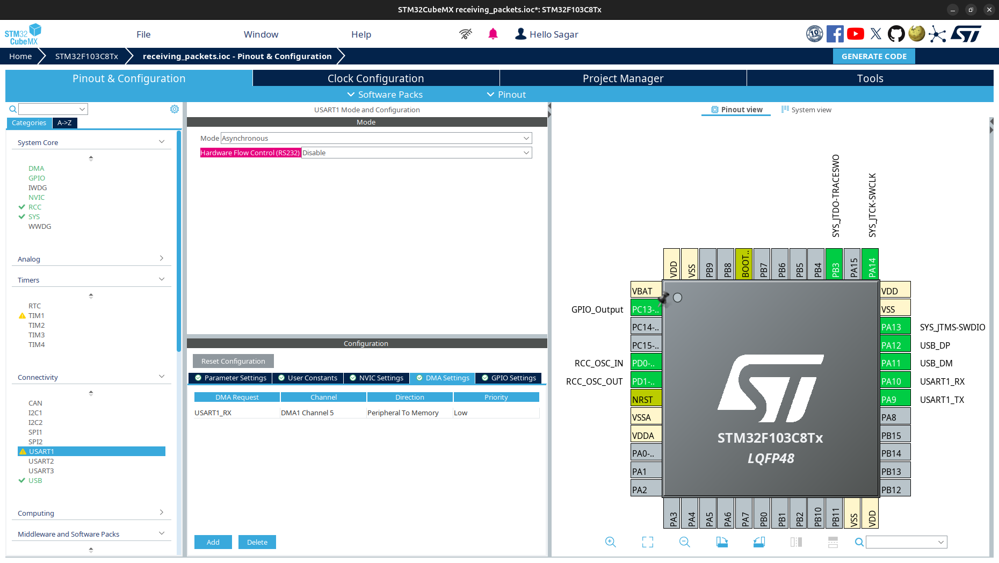

Sending and Receiving Packets
=============================

.. contents:: Contents
   :depth: 2
   :local:


1. Introduction
---------------

Sending and receiving one byte of data is simple. But what if you want to send and receive multiple bytes of data? Now, you need to think of a way to structure the data so that the receiver can determine the first byte when receiving bytes continuously. Long bytes of data are prone to errors. Now, you need to think of error detection. Let's start packetizing data.

A simple packet contains sunchronization bytes, data and error detection bytes. The simple synchronization method is using start bytes. Start bytes have a value which also can be present in data. The error detection bytes play important role to detect any misalignment and errors. There are techniques to calculate error detection bytes. The simple technique is checksum and a better technique is cyclic redundancy check (CRC).


2. Understanding Checksum
-------------------------

It is really easy to calculate checksum of data packet. Checksum is calculated using two method.

2.1. Addition based Checksum
^^^^^^^^^^^^^^^^^^^^^^^^^^^^
Checksum is calculated by adding each bytes of data. The addtion can overflowe if size of checksum is small. Consider size of checksum is one byte. Let's write test code to calculate checksum of bytes using addition.

.. literalinclude:: files/data_packets/addition_based_checksum.c
   :language: c
   :linenos:

Compile and run this test code.

2.2. XOR based Checksum
^^^^^^^^^^^^^^^^^^^^^^^
Let's talk about binary addition and XOR.

.. list-table::
   :header-rows: 1

   * - Addition
     - XOR
   * - 0 + 0 = 0
     - 0 XOR 0 = 0
   * - 0 + 1 = 1
     - 0 XOR 1 = 1
   * - 1 + 0 = 1
     - 1 XOR 0 = 1
   * - 1 + 1 = 0 (carry 1)
     - 1 XOR 1 = 0

Binary Addition and XOR are same for first three. But for two 1's, Addition takes carry but XOR neglects it. Let's write test code for XOR based checksum calculation.

.. literalinclude:: files/data_packets/xor_based_checksum.c
   :language: c
   :linenos:

Compile and run this code.


3. Need of CRC
--------------

Checksum is simple and fast but there is high chance of collision. Suppose two bytes having value ``3`` and ``4``. The sum is ``7``. Also suppose two bytes having vallue ``5`` and ``2``. The sum is ``7`` too. It is failure of checksum.

We have already discussed about CRC in `previous <crc.html>`_ tutorial. The CRC template class was general but it is bettr to have specific CRC class that has to be used for performance. Let's write a simple SMBus CRC-8 class.


4. Implementing SMBus CRC-8
--------------------------- 

.. line-block::

   **Width**: 8
   **Polynomial**: 0x07
   **Initial Value**: 0x00
   **Final XOR Value**: 0x00
   **Reflect Input**: False
   **Reflect Output**: False

Let's create header and souce file.

.. literalinclude:: files/data_packets/crc8.hpp
   :language: cpp
   :linenos:
   :caption: crc8.hpp

The constructor of ``CRC8`` class is private so no multiple instances will be created by ``user`` except one we created as static member. Such type of class is called ``singletone`` class.

.. literalinclude:: files/data_packets/crc8.cpp
   :language: cpp
   :linenos:
   :caption: crc8.cpp

To ensure the ``CRC8`` compatibility with other ``CRC8``, the ``loockup table`` and ``check`` value are compared.  Now write the test code.

.. literalinclude:: files/data_packets/crc8_test.cpp
   :language: cpp
   :linenos:
   :caption: crc8_test.cpp

Compile and run this code.

.. code-block:: bash

   g++ crc8.cpp crc8_test.cpp -o crc8_test
   ./crc8_test

.. code-block:: none
   :caption: Output

   0x00, 0x07, 0x0E, 0x09, 0x1C, 0x1B, 0x12, 0x15, 
   0x38, 0x3F, 0x36, 0x31, 0x24, 0x23, 0x2A, 0x2D, 
   0x70, 0x77, 0x7E, 0x79, 0x6C, 0x6B, 0x62, 0x65, 
   0x48, 0x4F, 0x46, 0x41, 0x54, 0x53, 0x5A, 0x5D, 
   0xE0, 0xE7, 0xEE, 0xE9, 0xFC, 0xFB, 0xF2, 0xF5, 
   0xD8, 0xDF, 0xD6, 0xD1, 0xC4, 0xC3, 0xCA, 0xCD, 
   0x90, 0x97, 0x9E, 0x99, 0x8C, 0x8B, 0x82, 0x85, 
   0xA8, 0xAF, 0xA6, 0xA1, 0xB4, 0xB3, 0xBA, 0xBD, 
   0xC7, 0xC0, 0xC9, 0xCE, 0xDB, 0xDC, 0xD5, 0xD2, 
   0xFF, 0xF8, 0xF1, 0xF6, 0xE3, 0xE4, 0xED, 0xEA, 
   0xB7, 0xB0, 0xB9, 0xBE, 0xAB, 0xAC, 0xA5, 0xA2, 
   0x8F, 0x88, 0x81, 0x86, 0x93, 0x94, 0x9D, 0x9A, 
   0x27, 0x20, 0x29, 0x2E, 0x3B, 0x3C, 0x35, 0x32, 
   0x1F, 0x18, 0x11, 0x16, 0x03, 0x04, 0x0D, 0x0A, 
   0x57, 0x50, 0x59, 0x5E, 0x4B, 0x4C, 0x45, 0x42, 
   0x6F, 0x68, 0x61, 0x66, 0x73, 0x74, 0x7D, 0x7A, 
   0x89, 0x8E, 0x87, 0x80, 0x95, 0x92, 0x9B, 0x9C, 
   0xB1, 0xB6, 0xBF, 0xB8, 0xAD, 0xAA, 0xA3, 0xA4, 
   0xF9, 0xFE, 0xF7, 0xF0, 0xE5, 0xE2, 0xEB, 0xEC, 
   0xC1, 0xC6, 0xCF, 0xC8, 0xDD, 0xDA, 0xD3, 0xD4, 
   0x69, 0x6E, 0x67, 0x60, 0x75, 0x72, 0x7B, 0x7C, 
   0x51, 0x56, 0x5F, 0x58, 0x4D, 0x4A, 0x43, 0x44, 
   0x19, 0x1E, 0x17, 0x10, 0x05, 0x02, 0x0B, 0x0C, 
   0x21, 0x26, 0x2F, 0x28, 0x3D, 0x3A, 0x33, 0x34, 
   0x4E, 0x49, 0x40, 0x47, 0x52, 0x55, 0x5C, 0x5B, 
   0x76, 0x71, 0x78, 0x7F, 0x6A, 0x6D, 0x64, 0x63, 
   0x3E, 0x39, 0x30, 0x37, 0x22, 0x25, 0x2C, 0x2B, 
   0x06, 0x01, 0x08, 0x0F, 0x1A, 0x1D, 0x14, 0x13, 
   0xAE, 0xA9, 0xA0, 0xA7, 0xB2, 0xB5, 0xBC, 0xBB, 
   0x96, 0x91, 0x98, 0x9F, 0x8A, 0x8D, 0x84, 0x83, 
   0xDE, 0xD9, 0xD0, 0xD7, 0xC2, 0xC5, 0xCC, 0xCB, 
   0xE6, 0xE1, 0xE8, 0xEF, 0xFA, 0xFD, 0xF4, 0xF3, 
   
   CRC-8 hash: f4


5. Sending Packets through UART using Arduino
---------------------------------------------

Let's suppose you want to send packets that contains joystick data twist(vx, vy, w). To do so, select one start byte ``0xA5``, then three bytes for vx, vy and w, and one byte for CRC.

- Create a ``new sketch`` in ``Arduino IDE``. Save it as ``sending_packets``.

- Open ``terminal`` in the ``Arduino IDE`` using ``ctrl`` + `````. Create files ``crc8.hpp`` and ``crc8.cpp``.

  .. code-block:: arduino

     touch crc8.hpp touch crc8.cpp

- Copy the contents of ``crc8.hpp`` and ``crc8.cpp`` from above `section 4 <#implementing-smbus-crc-8>`_.

- Now copy and paste these contensts in ``sending_packets.ino``.

  .. literalinclude:: files/data_packets/sending_packets.ino
     :language: cpp
     :linenos:
     :caption: sending_packets.ino

- Compile and upload the code to your ``Arduino``.


6. Receiving Packets through UART using Arduino
-----------------------------------------------

Now you have to receive packets and parse them. The format used for sending packets should be same while parsing.

- Create a ``new sketch`` in ``Arduino IDE``. Save it as ``receiving_packets``.

- Open ``terminal`` in the ``Arduino IDE`` using ``ctrl`` + `````. Create files ``crc8.hpp`` and ``crc8.cpp``.

   .. code-block:: arduino

      touch crc8.hpp touch crc8.cpp

- Copy the contents of ``crc8.hpp`` and ``crc8.cpp`` from above `section 4 <#implementing-smbus-crc-8>`_.

- Now copy and paste these contensts in ``receiving_packets.ino``.

  .. literalinclude:: files/data_packets/receiving_packets.ino
     :language: cpp
     :linenos:
     :caption: receiving_packets.ino

  This receiving code is written for ``Arduino Mega``. You may want to modify it for other boards. It is better to use microcontroller having atleast two UARTs like ``Arduino Mega`` has three UARTs.

- Compile and upload the code to your ``Arduino``.

- Connect the ``TX pin`` of ``Sender`` and ``RX pin`` of ``Receiver``. Common ``GND`` of both.

- Open ``Serial Monitor`` in the ``Arduino IDE``. Set boudrate to ``115200`` or that in your code. You will see the parsed data.

.. image:: images/receiving_in_arduino.png
   :width: 100%
   :align: center
   :alt: receiving_in_arduino.png
   :class: padded-image

.. note::
   It is better to include start byte in the CRC calculation. So if data are misaligned, the CRC will not match. The receiver will discard the packet and wait for next packet.

   For example, CRC of one byte ``0x12`` is same as CRC of two bytes ``0x00`` and ``0x12`` because of adding ``0`` at the left of a number does not change its value i.e. ``0x12`` is equal to ``0x0012``. But if you include start byte, the CRC will be different.

.. note::
   The more standard way to check error at receiver side is to calculate CRC of data including CRC sent from transmitter. If the accumulated CRC is ``0``, then the data is correct. If not, then there is error in the data.


7. Sending Packets through UART using STM32
-------------------------------------------

- Create and generate new STM32 project using **STM32CubeMX**.

  - ``Project Name``: ``sending_packets``
  - ``Microcontroller``: ``STM32F103C8`` or any other STM32 microcontroller
  - ``Toolchain/IDE``: ``Makefile`` or ``CMake``

- Go to ``Connectivity`` and select any ``USART`` with mode ``Asynchronous``. Under ``DMA settings``, enable ``DMA`` for ``Transmit``. Follow the `UART with DMA tutorial <../stm32_basics_tutorial.html>`_ to setup more details.

- Also assign an ``LED`` pin for ``GPIO_Output.``

  .. image:: images/sending_packets_cubemx.png
     :width: 100%
     :align: center
     :alt: sending_packets_cubemx.png
     :class: padded-image

- Follow `C++ setup tutorial <cpp_setup_in_stm32.html>`_ and setup up to compile ``C++`` souce codes. In the `C++ setup tutorial <cpp_setup_in_stm32.html>`__, you have already created ``app.h`` and ``app.cpp``, and blinked the LED. Reach to that point.

- Create a new file ``crc8.hpp`` and ``crc8.cpp`` in ``Core > Inc`` and ``Core > Src`` respectively. Copy the contents of ``crc8.hpp`` and ``crc8.cpp`` from above `section 4 <#implementing-smbus-crc-8>`_.

- Update ``app.h`` and ``app.cppp``.

  .. literalinclude:: files/data_packets/send_app.h
     :language: cpp
     :linenos:
     :caption: app.h

  .. literalinclude:: files/data_packets/send_app.cpp
     :language: cpp
     :linenos:
     :caption: app.cpp

- Add souces to ``Makefile`` or ``CMakeLists.txt``.

- Build and upload the code to your ``STM32``.


8. Receiving Packets through UART using STM32
---------------------------------------------

- Create and generate new STM32 project using **STM32CubeMX**.

  - ``Project Name``: ``receiving_packets``
  - ``Microcontroller``: ``STM32F103C8`` or any other STM32 microcontroller
  - ``Toolchain/IDE``: ``Makefile`` or ``CMake``

- Go to ``Connectivity`` and select any ``USART`` with mode ``Asynchronous``. Under ``DMA settings``, enable ``DMA`` for ``Receive``. Follow the `UART with DMA tutorial <../stm32_basics_tutorial.html>`_ to setup more details.

- Assign assign an ``LED`` pin for ``GPIO_Output.`` If you want to print over ``USB``, enable ``USB`` and ``Virtual COM Port``. See `USB tutorial <../stm32_basics_tutorial/usb/usb_printf.html>`_. 



- Follow `C++ setup tutorial <cpp_setup_in_stm32.html>`_ and setup up to compile ``C++`` souce codes. In the `C++ setup tutorial <cpp_setup_in_stm32.html>`_, you have already created ``app.h`` and ``app.cpp``, and blinked the LED. Reach to that point.

- Create a new file ``crc8.hpp`` and ``crc8.cpp`` in ``Core > Inc`` and ``Core > Src`` respectively. Copy the contents of ``crc8.hpp`` and ``crc8.cpp`` from above `section 4 <#implementing-smbus-crc-8>`_.

- Add ``printf_config.c`` in ``Core > Src``. Copy the contents below.

  .. literalinclude:: files/data_packets/printf_config.c
     :language: c
     :linenos:
     :caption: printf_config.c

  Change definition to use ``ITM``.

- Update ``app.h`` and ``app.cpp``.

  .. literalinclude:: files/data_packets/receive_app.h
     :language: cpp
     :linenos:
     :caption: app.h

  .. literalinclude:: files/data_packets/receive_app.cpp
     :language: cpp
     :linenos:
     :caption: app.cpp

- Add souces to ``Makefile`` or ``CMakeLists.txt``.

- Build and upload the code to your ``STM32``.

Connect the ``TX pin`` of ``Sender`` and ``RX pin`` of ``Receiver``. Common ``GND`` of both. Observe the data on ``USB`` or ``ITM`` using ``Serial Monitor or Terminal`` or ``STM32CubeProgrammer SWV``.
