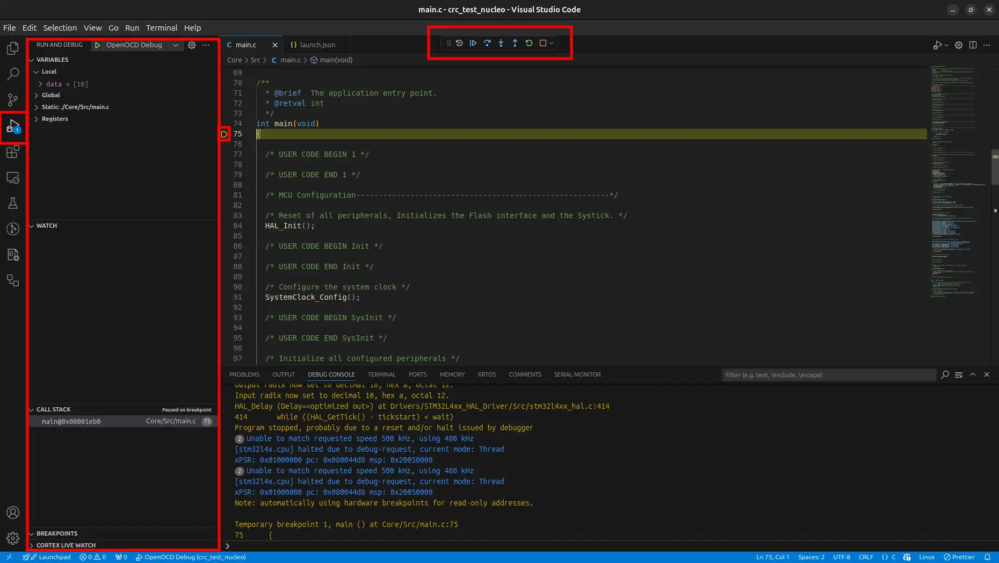

Debug using SWD
===============

.. contents:: Contents
   :depth: 2
   :local:
   

Introduction
------------

**Cortex-Debug** is an extension for **Visual Studio Code** to streamline the debug process when working with **ARM Cortex-M** microcontrollers.

Requirements
------------

If you did not install these previously, you need to install now.

- **Cortex-Debug**

  Install ``Cortex-Debug`` extension by **marus25** in VSCODE.

- **gdb-multiarch**

  Install ``gdb-multiarch`` by executing command ``sudo apt install gdb-multiarch``.

   
Setup for **ST-Link** or **JLink**
----------------------------------

Update or create ``.vscode/lauch.json`` file.

.. code-block:: json
   :linenos:
   :emphasize-lines: 10, 14-17
   :caption: lauch.json

       {
        // Use IntelliSense to learn about possible attributes.
        // Hover to view descriptions of existing attributes.
        // For more information, visit: https://go.microsoft.com/fwlink/?linkid=830387
        "version": "0.2.0",
        "configurations": [
            {
                "name": "Cortex Debug",
                "cwd": "${workspaceFolder}",
                "executable": "${workspaceFolder}/build/BasicSetup.elf",
                "request": "launch",
                "type": "cortex-debug",
                "runToEntryPoint": "main",
                "device": "STM32F407VG",
                "interface": "swd",
                "servertype": "stlink",
                "gdbPath": "/usr/bin/gdb-multiarch"
            }
        ]
       }

Change ``.elf`` filename for ``executable`` and device name for ``device`` (for bluepill, "device": "STM32F103C8").For ``jlink``, change "servertype": "jlink".

Setup for **OpenOCD**
---------------------

``OpenOCD`` server is better than ``ST-Link`` server. We also prefer to use ``OpenOCD`` instead of ``ST-Link`` but it is not neccessary. 

Install ``OpenOCD`` by executing command ``sudo apt install openocd``. Update ``.vscode/launch.json``.

.. code-block:: json
   :linenos:
   :emphasize-lines: 7, 11-18
   :caption: launch.json

   {
       "version": "0.2.0",
       "configurations": [
           {
               "name": "OpenOCD Debug",
               "cwd": "${workspaceFolder}",
               "executable": "${workspaceFolder}/build/BasicSetup.elf",
               "request": "launch",
               "type": "cortex-debug",
               "runToEntryPoint": "main",
               "device": "STM32F407VG",
               "interface": "swd",
               "servertype": "openocd",
               "configFiles": [
                   "interface/stlink-v2-1.cfg",
                   "target/stm32f4x.cfg"
               ],
               "gdbPath": "/usr/bin/gdb-multiarch"
           }
       ]
   }

Change ``.elf`` filename for ``executable`` and device name for ``device``. Also you need to chage ``configFiles`` (e.g. target/stm32f1x.cfg for bluepill or interface/jlink.cfg for jlink interface). For more about **OpenOCD**, watch ::newtab:`this <https://www.youtube.com/watch?v=_1u7IOnivnM>`.

Run Debugger
------------

- Connet your ST-Link or JLink to your microcontroller and your PC. If you use external ``debugger`` like ``JLink`` or ``ST-Link`` adapter, connect it as:
  
  * ``SWCLK`` of microcontroller to ``SWCLK`` of debugger.
  * ``SWDIO`` of microcontroller to ``SWDIO`` of debugger.
  * ``SWO`` of microcontroller to ``SWO`` of debugger. (Optional, only if you want to see ITM messages)
  * ``NRST`` of microcontroller to ``NRST`` of debugger. (Optional, only if you want to hard reset microcontroller using debugger)
  * ``GND`` of microcontroller to ``GND`` of debugger.
  * ``3V3`` of microcontroller to ``3V3`` of debugger.

- Go to ``Run and Debug`` section in VSCODE.
- Click ``Run`` button.

You will see a floating toolbar which you can use for ``continue``, ``step over``, ``step into``, ``step out``,  ``restart`` and ``stop``.

