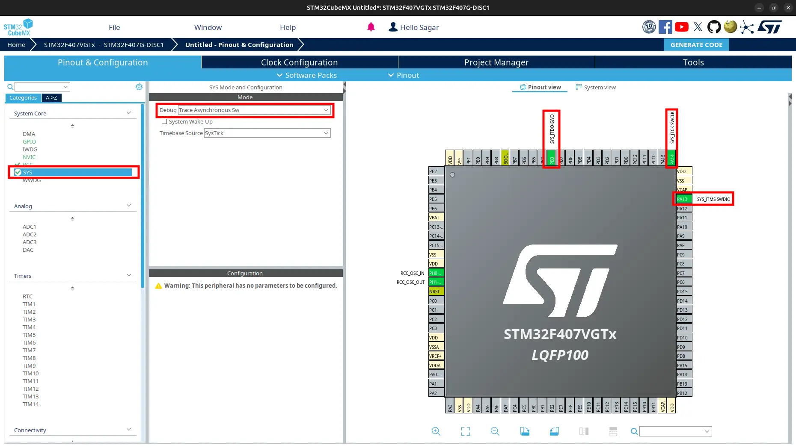
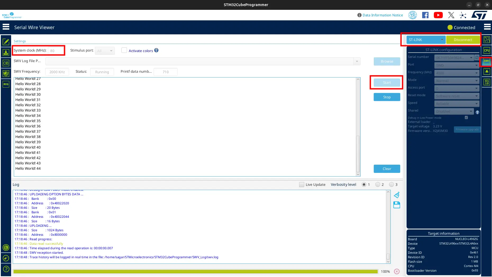

Print using SWD
===============

.. contents:: Contents
   :depth: 2
   :local:

.. attention::
   ``ITM SWV Console`` does not work using our ``duplicate ST-Link V2`` adapter. So using ``bluepill``, ``USB`` is used for ``printf`` in our case.

.. warning::
   ``SWV`` does not work in **STM32F407VG-DISC1** board if you use ``PB3`` pin because it is connected to ``SWO`` pin of **ST-Link**.

1. Introduction
---------------

SWD also can be used to print data. But we cannot get them normally. We need speacial program to see which is ``Serial Wire Viewer (SWV)``. ``STM32CubeProgrammer`` has  SWV. Download it from `installation <../../getting_started/installation.html>`_.

In order to trace information, **Instrumentation Trace Macrocell (ITM)** is used in **ARM** processors. It uses **SWO** pin for tracing.

2. Overwrite Definition of printf
---------------------------------

* `Generate baisc code <../basic_setup/generate_basic_code.html>`_.

.. important::
      **ITM** uses **SWO**, so select ``Debug`` option as ``Trace Asynchronous SW`` in **STM32CubeMX**.

* Create a new file ``printf_conf.c`` in ``Core/Src`` folder.

* Add the following code to the file:
  
  .. code-block:: c
     :linenos:
     :caption: printf_conf.c
     
     #include "stm32f4xx_hal.h" // for stm32f4

      int _write(int file, char *data, int len)
      {
        for (int i = 0; i < len; ++i)
        {
          ITM_SendChar(data[i]);
        }
        return len;
      }

3. Update Makefile or CMakeLists.txt
------------------------------------

* Add ``printf_config.c`` to source.

  .. tabs::
  
     .. tab:: Makefile
          
        .. code-block:: none
           :emphasize-lines: 4
  
           C_SOURCES = \
           ... \
           ... \
           Core/Src/printf_conf.c
  
     .. tab:: CMakeLists.txt
  
        .. code-block:: CMake
           :emphasize-lines: 4
  
           # Add sources to executable
           target_sources(${CMAKE_PROJECT_NAME} PRIVATE
              # Add user sources here
              Core/Src/printf_conf.c
           )  
  
* Add ``-u _printf_float`` flag.

  .. tabs::
     
     .. tab:: Makefile

        Add to ``LDFLAGS``.

        .. code-block:: Makefile
           :emphasize-lines: 2
           
           LDFLAGS = $(MCU) -specs=nano.specs -T$(LDSCRIPT) $(LIBDIR) $(LIBS) -Wl,-Map=$(BUILD_DIR)/$(TARGET).map,--cref -Wl,--gc-sections
           LDFLAGS += -u _printf_float

     .. tab:: CMakeLists.txt

        Create target_link_options at the bottom.

        .. code:: CMake

           target_link_options(${CMAKE_PROJECT_NAME} PRIVATE
               -u _printf_float
           )

4. Update main.c
----------------

* Open ``Core > Src > main.c``. Add ``stdio.h`` header.

  .. code-block:: c
     :emphasize-lines: 3

     /* Private includes ----------------------------------------------------------*/
     /* USER CODE BEGIN Includes */
     #include <stdio.h>
     /* USER CODE END Includes */

* Update ``main`` function to print "Hello World" over SWD.

  .. code-block:: c
     :emphasize-lines: 2, 8-9
     
     /* USER CODE BEGIN 2 */
     uint32_t n = 0;
     /* USER CODE END 2 */      
     /* Infinite loop */
     /* USER CODE BEGIN WHILE */
     while (1)
     {
       printf ("Hello World! %lu\n", n++);
       HAL_Delay(100);
       /* USER CODE END WHILE */      
       /* USER CODE BEGIN 3 */
     }
     /* USER CODE END 3 */

* Build and flash.

5. Open SWV on STM32CubeProgrammer
----------------------------------

* Open ``STM32CubeProgrammer``.

* Connect your microcontroller to your PC using USB cable through ``ST-Link``. If you use external ``debugger`` like ``JLink`` or ``ST-Link`` adapter, connect it as:
  
  * ``SWCLK`` of microcontroller to ``SWCLK`` of debugger.
  * ``SWDIO`` of microcontroller to ``SWDIO`` of debugger.
  * ``SWO`` of microcontroller to ``SWO`` of debugger. 
  * ``NRST`` of microcontroller to ``NRST`` of debugger. (Optional, only if you want to hard reset microcontroller using debugger)
  * ``GND`` of microcontroller to ``GND`` of debugger.
  * ``3V3`` of microcontroller to ``3V3`` of debugger.

* Click on ``Connect``.

* Click on ``SWV``.

* Set ``Core Clock`` to the microcontroller clock frequency configured in ``STM32CubeMx``. It is ``168MHz`` in this case.

* Click on ``Start``.

You can see the message "Hello World" on the ``SWV`` continously.

Do not be confused that I used 80MHz in clock frequency. I used different device at the time of this demo. Use your own.