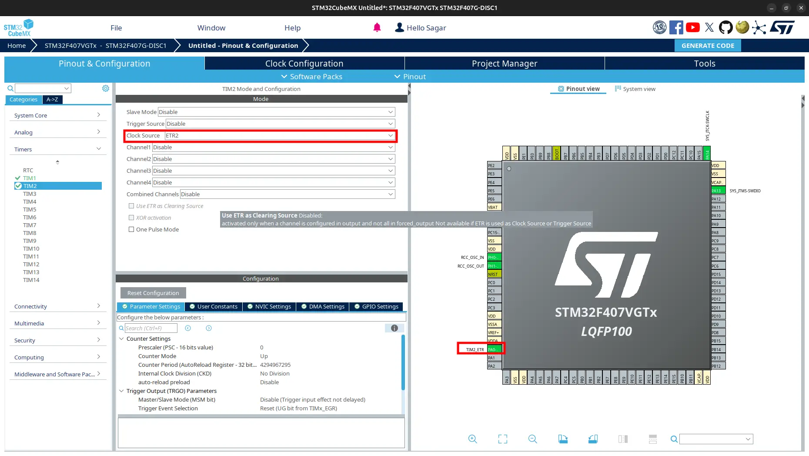
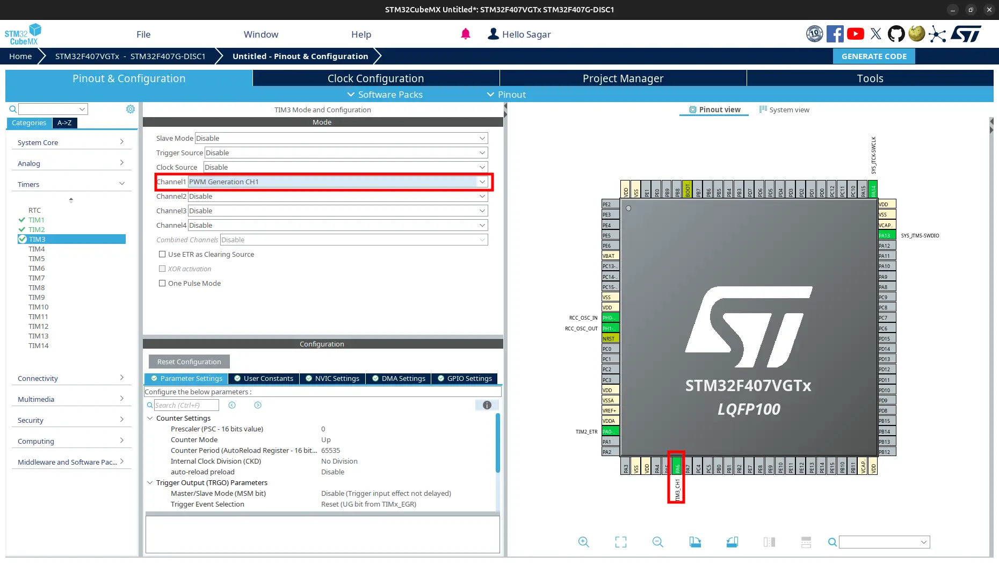

Frequency counter
=================

.. contents:: Contents
   :depth: 2
   :local:

1. Introduction
---------------

The frequency counter counts the number of cycles of an input signal over a specific time period and calculates the frequency based on the count. It is used to measure the frequency of periodic signals like square waves, sine waves, or pulses. The frequency counter can be implemented using timers in microcontrollers.

2. CubeMX Configuration
-----------------------

- Open CubeMX and `generate basic code <../basic_setup/generate_basic_code.html>`_ with:

  - microcontroller: ``stm32f407vgt6`` or board: ``STM32F407VG-DISC1``
  - project name: ``frequency_counter``
  - Toolchain/IDE: ``Makefile``

- Go to ``Pinout and Congiguration > Timers > TIM1`` and select **Clock Source**: ``Internal Clock``.

.. image:: images/freq_counter_microtick_conf.webp
   :width: 100%
   :align: center
   :alt: Frequency Counter Configuration for Microsecond Tick 

- Go to ``TIM2`` and select **Clock Source**: ``ETR2``.

- Go to ``TIM3`` and select **Channel1**: ``PWM Generation CH1``.

- Generate Code.

3. Code to Get Frequency
------------------------

- Navigate to ``Core > Src`` and open ``main.c``. 

- Include ``stdio.h`` for printf to print received data.

.. code-block:: c
  
  /* USER CODE BEGIN Includes */
  #include <stdio.h>
  /* USER CODE END Includes */

- Overwrite definition of ``_write`` as:

  .. code-block:: c
  
     /* USER CODE BEGIN 0 */
     int _write(int file, char *data, int len)
     {
       for (int i = 0; i < len; ++i)
       {
         ITM_SendChar(data[i]);
       }
       return len;
     }
     /* USER CODE END 0 */

- Create variable to store timer-1 period ellapsed count.

  .. code-block:: c
     
     /* USER CODE BEGIN PV */
     uint32_t htim1PeriodEllapsedCount = 0;
     /* USER CODE END PV */

- Increment the ``htim1PeriodEllapsedCount`` in  ``HAL_TIM_PeriodElapsedCallback``. Also add function to get microtick.

  .. code-block:: c
     
     /* USER CODE BEGIN 0 */
     // ...
     // ...
     
     void HAL_TIM_PeriodElapsedCallback(TIM_HandleTypeDef *htim)
     {
       if (htim->Instance == htim1.Instance)
       {
         htim1PeriodEllapsedCount++;
       }
     }
     
     uint64_t GetMicros()
     {
       return (uint64_t)htim1PeriodEllapsedCount * htim1.Instance->ARR + (uint64_t)htim1.Instance->CNT;
     }
     /* USER CODE END 0 */

- Add timer init code for  ``TIM1``, ``TIM2`` and ``TIM3``.

  .. code-block:: c
     
     /* USER CODE BEGIN 2 */
     HAL_TIM_Base_Start_IT(&htim1);
     HAL_TIM_Base_Start(&htim2);
     HAL_TIM_PWM_Start(&htim3, TIM_CHANNEL_1);
     /* USER CODE END 2 */

- Add code to get frequency of input signal.

  .. code-block:: c
     
     /* Infinite loop */
     /* USER CODE BEGIN WHILE */
     uint64_t startTick;
     uint64_t endTick;
     uint32_t count;
     double freq;

     htim3.Instance->CCR1 = (uint32_t)(0.5f * htim3.Instance->ARR);

     while (1)
     {
       startTick = GetMicros(); // using microsecond to get precise frequency
       htim2.Instance->CNT = 0;
       HAL_Delay(100); // 100ms sampling time
       count = htim2.Instance->CNT;
       uint64_t endTick = GetMicros();
       
       freq = (double)count / ((endTick - startTick) / 1000000.0);
       printf("Frequency: %f Hz\n", (float)freq);
       /* USER CODE END WHILE */
       
       /* USER CODE BEGIN 3 */
     }
     /* USER CODE END 3 */

- Build and flash the code.

.. warning::
   
   To print floating point, make sure you have added ``-u _printf_float`` to ``LDFLAGS`` in ``Makefile``. Otherwise it does not get printed.

4. View Output
--------------

- Connect ``TIM3_CH1`` pin to ``TIM2_ETR`` pin.

- Open ``STM32CubeProgrammer`` and view output on ``SWV``. If you used USB, see on terminal or serial monitor.

- Now, change the frequency of PWM signal to 50Hz and again view the output. To know how change PWM frequency, see :newtab:`PWM tutorial <pwm.html>`.
