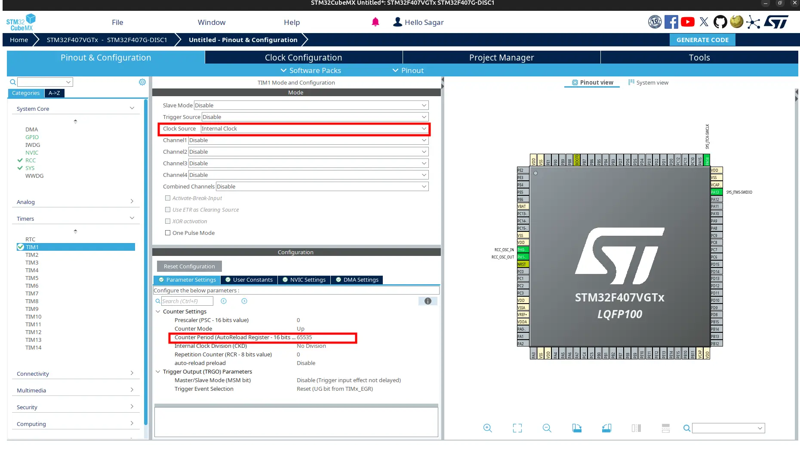

Microsecond Tick
================

.. contents:: Contents
   :depth: 2
   :local:

1. Introduction
---------------

Microsecond timing is used generally for sampling, pulse generation, frequency counter, precise calculation and many more. Using CPU clock, it may be diffucult to get microsecond ticks or it may not be precise. Timers can be do this job easily and precisely.

2. CubeMX Configuration
-----------------------

- Open CubeMX and `generate basic code <../basic_setup/generate_basic_code.html>`__ with:

  - microcontroller: ``stm32f407vgt6`` or board: ``STM32F407VG-DISC1``
  - project name: ``microtick``
  - Toolchain/IDE: ``Makefile``

- Go to ``Pinout and Congiguration > Timers > TIM1``. Select ``Internal Clock`` for **Clock Source**.

.. Tip:: It is better to keep **ARR** value to maximum i.e. `65535` for 32-bit.

- Generate Code.

3. Code to Get Microsecond Tick
-------------------------------

- Navigate to ``Core > Src`` and open ``main.c``.

- Include ``stdio.h`` for printf to print received data.

.. code-block:: c
  
  /* USER CODE BEGIN Includes */
  #include <stdio.h>
  /* USER CODE END Includes */

- Overwrite definition of ``_write`` as:

  .. code-block:: c
  
     /* USER CODE BEGIN 0 */
     int _write(int file, char *data, int len)
     {
       for (int i = 0; i < len; ++i)
       {
         ITM_SendChar(data[i]);
       }
       return len;
     }
     /* USER CODE END 0 */

- Create variable to store timer period ellapsed count.

  .. code-block:: c
     
     /* USER CODE BEGIN PV */
     uint32_t htim1PeriodEllapsedCount = 0;
     /* USER CODE END PV */

- When timer period ellapse, ``HAL_TIM_PeriodElapsedCallback`` is fired. Increment the ``htim1PeriodEllapsedCount`` in this callback. Also add function to get microtick.

  .. code-block:: c
     
     /* USER CODE BEGIN 0 */
     // ...
     // ...

     void HAL_TIM_PeriodElapsedCallback(TIM_HandleTypeDef *htim)
     {
       if (htim->Instance == htim1.Instance)
       {
         htim1PeriodEllapsedCount++;
       }
     }
     
     uint64_t GetMicros()
     {
       return (uint64_t)htim1PeriodEllapsedCount * htim1.Instance->ARR + (uint64_t)htim1.Instance->CNT;
     }
     /* USER CODE END 0 */

- Start the timer in interrupt mode inside `main()`.

  .. code-block:: c

     /* USER CODE BEGIN 2 */
     HAL_TIM_Base_Start_IT(&htim1);
     /* USER CODE END 2 */

- Now, you can use ``GetMicros()`` to get microsecond tick.

  .. code-block:: c

     /* Infinite loop */
     /* USER CODE BEGIN WHILE */
     while (1)
     {
       printf("Micros: %lu\n", GetMicros());
       HAL_Delay(100);
     }
     /* USER CODE END WHILE */

- Build and flash the code.

4. Observe Output
-----------------

Open ``STM32CubeProgrammer`` and see output on ``SWV``. If you used USB, see on terminal or serial monitor.
