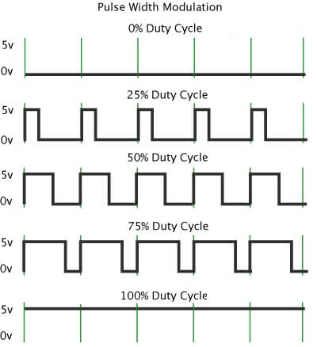

PWM
===

.. contents:: Contents
   :depth: 2
   :local:

1. Introduction
---------------

Pulse Width Modulation (PWM) is a technique used in embedded systems to generate analog-like signals using digital means. It works by varying the width of pulses (the "on" time) in a periodic waveform to encode information or control power delivered to a load.

The amplitude of PWM is equal to VDD of microcontroller; i.e. for arduino controller, it is 5V; for stm32 controllers, it is 3.3V.

The average output of a PWM signal is given by :math:`V_{avg} = \frac{\text{Pulse Width}}{\text{Time Period}} \cdot V_{dd}`.

2. CubeMX Configuration
-----------------------

- Open CubeMX and `generate basic code <../basic_setup/generate_basic_code.html>`_ with:

  - microcontroller: ``stm32f407vgt6`` or board: ``STM32F407VG-DISC1``
  - project name: ``pwm_test``
  - Toolchain/IDE: ``Makefile``

- Go to  ``Pinout and Congiguration > Timers > TIM1``. Select ``PWM Generation CH1`` for **CHANNEL1**.

- Generate code.

.. image:: images/pwm.webp
   :width: 100%
   :align: center
   :alt: PWM Configuration

3. Code to Change Duty Cycle
----------------------------

- Navigate to ``Core > Src`` and open ``main.c``. 

- Add to the ``main()`` as:

   .. code-block:: c
      :emphasize-lines: 28, 35-39
   
      int main(void)
      {
      
        /* USER CODE BEGIN 1 */
      
        /* USER CODE END 1 */
      
        /* MCU Configuration--------------------------------------------------------*/
      
        /* Reset of all peripherals, Initializes the Flash interface and the Systick. */
        HAL_Init();
      
        /* USER CODE BEGIN Init */
      
        /* USER CODE END Init */
      
        /* Configure the system clock */
        SystemClock_Config();
      
        /* USER CODE BEGIN SysInit */
      
        /* USER CODE END SysInit */
      
        /* Initialize all configured peripherals */
        MX_GPIO_Init();
        MX_TIM1_Init();
        /* USER CODE BEGIN 2 */
        HAL_TIM_PWM_Start(&htim1, TIM_CHANNEL_1);
        /* USER CODE END 2 */
      
        /* Infinite loop */
        /* USER CODE BEGIN WHILE */
        while (1)
        {
          float duty = 0.5f;
          htim1.Instance->CCR1 = (uint32_t)(duty * htim1.Instance->ARR);
          
          // You can also use the HAL function to set the duty cycle:
          // __HAL_TIM_SET_COMPARE(&htim1, TIM_CHANNEL_1, (uint32_t)(duty * htim1.Instance->ARR));
      
          /* USER CODE END WHILE */
      
          /* USER CODE BEGIN 3 */
        }
        /* USER CODE END 3 */

4. Test Output
--------------

- Connect the ``TIM1_CH1`` pin to positive of an ``LED`` and negative terminal to ``GND``.

- Change the value of ``duty`` to ``0``, ``0.1f``, ``0.8f`` and ``1.0f``, and observe the **brightness of LED**.

- Observe the output on **Oscilloscope**.

**Assignment**: Control the speed of a motor using any motor driver available.

.. caution::

   If ``PWM pin`` is pulled up, it sends logic high at reset. So make sure not to use pulled up pins for ``PWM`` to control **motors**. But you can use the pulled up pins to control **servo motors**. **STM32F407VG-DISC1** board have many pulled up pins as it contains many peripherals. You can check them using **multimeter** under reset. To hold the reset, use **STM32CubeProgrammer**. If you connect it and open ``SWV``, it is under reset uintill you press ``START``. 

5. Changing the Frequency of PWM
--------------------------------

The PWM frequency on an STM32 microcontroller can be calculated using the formula:

.. math::

   f_{\text{PWM}} = \frac{f_{\text{TIM}}}{\text{(ARR + 1) * (PSC + 1)}}

.. line-block::

   where,
   :math:`f_{\text{TIM}}`: Frequency of timer
   :math:`\text{ARR}`: Auto Reload Register Value
   :math:`\text{PSC}`: Prescaler

.. raw:: html

   

       <label for="freqTIM1" style="font-weight: bold;">fTIM (Hz):</label>
       <input type="number" id="freqTIM1" placeholder="Enter timer frequency (Hz)" style="margin-bottom: 10px; width: 100%; padding: 5px;">

       <label for="psc1" style="font-weight: bold;">PSC:</label>
       <input type="number" id="psc1" placeholder="Enter PSC value" style="margin-bottom: 10px; width: 100%; padding: 5px;">
       
       <label for="arr1" style="font-weight: bold;">ARR:</label>
       <input type="number" id="arr1" placeholder="Enter ARR value" style="margin-bottom: 10px; width: 100%; padding: 5px;">
       
       <button onclick="calculatePWM()" style="background-color: #4CAF50; color: white; border: none; padding: 10px; cursor: pointer; width: 100%;">Calculate PWM Frequency</button>
       
       

   

   

To determine the **frequency of timer**, first you need to find out the **APB timer clock** in the **reference mannual** of the microcontroller. 

- On ``STM32CubeMX``, hover the cursor on ``Timers``. 

- Click the ``details and documentation`` and then ``Reference mannual``. Or click :newtab:`reference mannual link <https://www.google.com/url?sa=t&source=web&rct=j&opi=89978449&url=https://www.st.com/resource/en/reference_manual/dm00031020-stm32f405-415-stm32f407-417-stm32f427-437-and-stm32f429-439-advanced-arm-based-32-bit-mcus-stmicroelectronics.pdf&ved=2ahUKEwiS2sXckL2IAxW3_aACHV3sIHsQFnoECBoQAQ&usg=AOvVaw2x8tbTRz8d9PfqXBk3qZ74>`.

- You can find the **APB** number under **Memory and bus architecture**.

  .. image:: images/apb_check.png
     :width: 100%
     :align: center
     :alt: APB Peripheral Clock

Now on  ``STM32CubeMx``, go to ``Clock Configuration`` tab and check the target **APB** clock frequency.

 .. image:: images/clock_conf.png
    :width: 100%
    :align: center
    :alt: Clock Configuration

For this case, for ``TIM1``, the **APB2** timer clock is ``168MHz``.

Suppose, we want the PWM frequency to be ``50Hz``. For this we need to calculate and adjust the **ARR** and **PSC** values.

If :math:`f_{\text{TIM}}` is ``168MHz``, :math:`\text{PSC}` is ``167`` and :math:`f_{\text{PWM}}` is ``50Hz``, then :math:`\text{ARR}` will be:

.. math::

   \text{ARR} = \frac{f_{\text{TIM}}}{f_{\text{PWM}} \times (\text{PSC} + 1)} - 1

   = \frac{168 \times 10^6}{50 \times (167 + 1)} - 1

   = 19999

.. _arr_calculator:

.. raw:: html

   

       <label for="freqPWM2" style="font-weight: bold;">fPWM (Hz):</label>
       <input type="number" id="freqPWM2" placeholder="Enter PWM frequency (Hz)" style="margin-bottom: 10px; width: 100%; padding: 5px;">

       <label for="freqTIM2" style="font-weight: bold;">fTIM (Hz):</label>
       <input type="number" id="freqTIM2" placeholder="Enter timer frequency (Hz)" style="margin-bottom: 10px; width: 100%; padding: 5px;">

       <label for="psc2" style="font-weight: bold;">PSC:</label>
       <input type="number" id="psc2" placeholder="Enter PSC value" style="margin-bottom: 10px; width: 100%; padding: 5px;">

       <button onclick="calculateARR()" style="background-color: #4CAF50; color: white; border: none; padding: 10px; cursor: pointer; width: 100%;">Calculate ARR</button>
       
       

   

   

.. note::

   We chose :math:`\text{PSC}` as `167` because the :math:`f_{\text{TIM}}` is `168MHz`. So :math:`\frac{f_{\text{TIM}}}{\text{PSC} + 1}` will be `1MHz` for easy calculation.

.. warning::

   To get good response from DC motors, higher PWM frequency is better but motordriver should be capable to handle that frequency. Lower frequency can make **tunning sound** from DC motors. I used ``8KHz`` pwm frequency for **planetary gear motors**. 

Go to ``Pinout & Configuration > Timers > TIM1 > Parameter Settings`` and set the **ARR** value to ``19999`` and **PSC** value to ``167``.

.. image:: images/freq_change.webp
   :width: 100%
   :align: center
   :alt: PWM Frequency Configuration
   :class: padded-image

Generate the code, change the **duty cycle** between ``0%`` and ``100%``. Observe the output frequency on the oscilloscope.

**Assignment**: Control the angle of a servo motor.

.. Hint:: 

   For :math:`f_{\text{PWM}} = 50\,\text{Hz}`, time period :math:`T = 20\,\text{ms}`. 
   And :math:`1\,\text{ms} \equiv 0^\circ` and :math:`2\,\text{ms} \equiv 180^\circ`.

   .. code-block:: c

      const float timePeriod = 20.0f; // in ms
      float duty = map<float>(angle, 0, 180, 1, 2); // in ms

      htim1.Instance->CCR1 = (uint32_t)(htim1.Instance->ARR * duty / timePeriod);

.. Tip::

   .. figure:: images/esc.webp
      :figwidth: 200px
      :align: right
      :alt: ESC
      :figclass: center-caption
      
      ESC

   To control **Brushless DC Motor (BLDC)**, **Electronic Speed Controller (ESC)** is used that accepts **RC Servo PWM** signal. Servo can run just after power on, but **ESC** does not allow you run just after **power on**. There are **calibration** and **arming** process just after **power on** indicated by **beep sound**. **Calibration** is to set the full and low throttle for control and **arming** is for safety purpose that does not allow to run accidentally. Generally calibrate zero throttle **1ms** and high throttle **2ms** at **50Hz**.
   
   To **calibrate**, use **full throttle (2ms pulse)** for **2 seconds** and then use **zero throttle (1ms pulse)** for **2 seconds**. You don't need to **calibrate** it again until you change the **ESC** or **BLDC**.
   
   To **arm**, use **zero throttle** for **2 seconds**. You need to **arm** every time after **power on** otherwise **ESC** wiil make **rapid beeping sound** to alert.